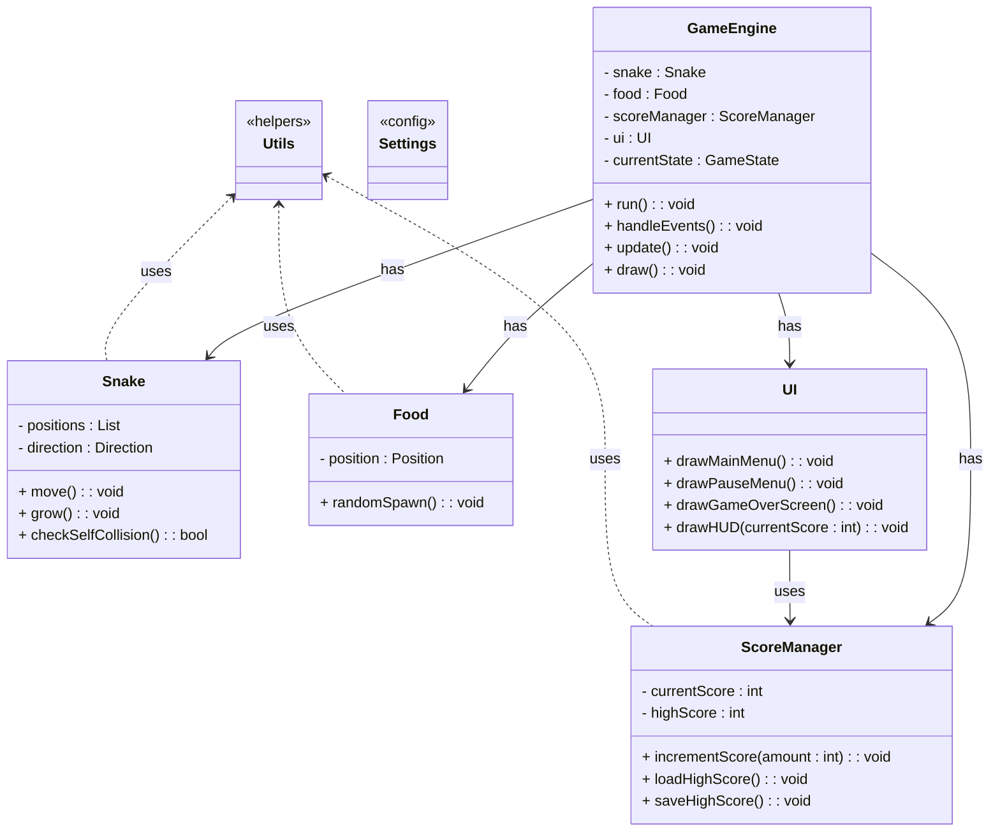

Below is a **conceptual guide** to splitting your Snake Game code into 7 files, with an emphasis on modularity and maintainability. This guide does **not** provide actual code samples, but instead focuses on **why** and **how** you might organize your project in a way that keeps each component self-contained.

---

## 1. Overview & Rationale

When building any larger project—like a Snake Game—it’s best to avoid **monolithic** files containing **all** your logic in one place. By splitting your code into multiple files (modules), you:

1. Make the code easier to **navigate** (you know exactly where to look for UI vs. gameplay vs. scoring).
2. **Isolate** functionality (changes in one module are less likely to break other parts of the program).
3. Facilitate **teamwork** (different developers can work on different modules without constantly stepping on each other’s toes).

---

## 2. Identify the Core Components

Before creating files, outline the **core responsibilities** of your game. A Snake Game typically has:

1. **Main Game Flow or Engine** – Manages the game loop, updates, drawing, and state transitions.  
2. **Entities (Actors)** – The Snake, Food, possibly Obstacles or AI opponents.  
3. **UI (User Interface)** – Menus, heads-up display, game over screen, etc.  
4. **Scoring & Persistence** – Tracks current scores, high scores, saving/loading.  
5. **Settings / Configuration** – Constants like screen size, colors, or speeds.  
6. **Utilities / Helpers** – Common helper functions (e.g., collision detection).  
7. **Main Entry Point** – A `main.py` that ties everything together and starts the game.

---

## 3. Create the File Structure

A typical Python project layout might look like this:

```
my_snake_game/
│
├─ main.py
├─ engine.py          
├─ entities.py
├─ ui.py
├─ score.py
├─ settings.py
└─ utils.py
```

If you want to group certain files in subfolders (e.g., a `ui/` folder), that’s also fine. The exact organization can vary, but below is a **7-file** approach.

---

### 3.1 `main.py` – The Entry Point

- **Purpose**: This file is where the program starts executing (`if __name__ == "__main__":`). It sets up the environment, initializes the core game engine, and runs the main loop.
- **Why**: Keeping an entry point separate allows you to keep your **game logic** independent from the way the game is **started**.  
- **How**:
  - Import `engine.py` (or `game_manager.py`), `settings.py`, etc.
  - Initialize the game engine or manager class.
  - Kick off the main loop.

> **Tip**: `main.py` should be very short—just a few lines that “wire” everything together.

---

### 3.2 `engine.py` (or `game_manager.py`) – Core Game Logic

- **Purpose**: Handles the **game loop**: updating entities, handling input, rendering, and managing transitions between states (e.g., menu \(\to\) playing, playing \(\to\) game-over).
- **Why**: This is the **brains** of your game. By isolating all the “when to update / draw” logic, you avoid scattering the flow control across different files.
- **How**:
  - Define a class like `GameEngine` or `GameManager`.
  - Keep references to the **Snake**, **Food**, **Score** (from `score.py`), and anything else needed for the main loop.
  - Implement methods: `handle_events()`, `update()`, `draw()`, `run()`.
  - Manage **states** using Enums or constants (MENU, PLAYING, PAUSED, GAME_OVER).

> **Tip**: If your main loop is in `engine.py`, your `main.py` just needs to create an engine instance and call something like `game_engine.run()`.

---

### 3.3 `entities.py` – Snake, Food, and Other Actors

- **Purpose**: Houses your **Snake** class, **Food** class, and any other game objects (like obstacles or AI snakes).
- **Why**: Group all “things that exist in the game world” into a single module. This is intuitive: you open `entities.py` to see how the snake or other entities behave.
- **How**:
  - `class Snake`: manages position (list of coordinates for body segments), movement, growth logic.
  - `class Food`: manages random placement, possibly a respawn method.
  - **Optional** classes for obstacles or power-ups.
- **Communication**: The engine uses these classes to update positions, check collisions, or draw them.  

> **Tip**: Keep your entity classes relatively short. If the snake gets too large, you can consider a dedicated file or sub-module just for it.

---

### 3.4 `ui.py` – Menus, HUD, and Other User Interface Elements

- **Purpose**: Handles **all** user-facing screens outside the main gameplay area:  
  - Main Menu (Play, Settings, Exit)  
  - Pause Menu (Resume, Main Menu)  
  - Game Over Screen (Final score, high score)  
  - In-game HUD (score display)
- **Why**: All UI logic (layout, text, rendering) is kept in one place, ensuring clarity and avoiding bloating the core game engine.
- **How**:
  - Provide functions like `draw_main_menu()`, `draw_pause_menu()`, or classes like `Menu` or `HUD`.
  - Possibly track menu state, button selections, etc.

> **Tip**: The engine can call `ui.draw_main_menu()` or `ui.draw_game_over_screen()` based on the game’s current state.

---

### 3.5 `score.py` – Scoring & Persistence

- **Purpose**: Tracks **current score** and **high score**, handles saving/loading data.
- **Why**: Centralizing scoring logic streamlines changes. If you decide to store high scores in a database or on the cloud, you only adjust `score.py`.
- **How**:
  - Maintain global or class-level variables for the current score and high score.
  - Implement `save_high_score()` and `load_high_score()` to handle file IO (e.g., JSON, CSV, or text).
  - Expose methods to **increment** the score or retrieve it for display in the UI.

> **Tip**: Keep scoring concerns separate from the game engine to reduce coupling.

---

### 3.6 `settings.py` – Configuration & Constants

- **Purpose**: Define **all** constants that shape your game’s configuration:
  - Screen width, height, FPS  
  - Snake speed, color definitions  
  - Resource file paths (if any)  
  - Block size (for grid-based movement)
- **Why**: Storing these in a single file makes it easy to tweak or reference them across your game.
- **How**:
  - Just create variables or a dictionary for configuration.  
  - **Example**: `SCREEN_WIDTH = 640`, `SCREEN_HEIGHT = 480`, `SNAKE_SPEED = 5`.
  - Optionally parse from a config file (JSON, INI) if needed.

> **Tip**: By importing `settings.py` everywhere you need, changes to constants become a single-file edit.

---

### 3.7 `utils.py` – General Helper Functions

- **Purpose**: Hosts **miscellaneous** or “stand-alone” functions that can be re-used anywhere (collision checks, random position generation, file helpers).
- **Why**: Keeps your code **DRY** (Don’t Repeat Yourself). If multiple parts of your game do random spawning or collision checking, they can call the same helper function in `utils`.
- **How**:
  - Write small functions like `check_collision(entity1, entity2)`, `generate_random_position()`.
  - If certain logic grows too large, consider splitting it out into its own module, or keep it very targeted.

> **Tip**: Make sure helpers are truly general-purpose. Don’t clutter `utils.py` with code that belongs to a single specialized module.

---

## 4. Step-by-Step Splitting Process

1. **Start with a Single-File Version**  
   - Have your entire Snake Game in `main.py` initially (if that’s the stage you’re at).

2. **Isolate the Game Flow**  
   - Extract all logic that deals with updating, drawing, and the main loop into `engine.py`.  
   - Keep `main.py` only for starting the engine.

3. **Separate Out the Entities**  
   - Move your Snake class and Food class into `entities.py`.  
   - Remove references to these from `engine.py` except for where the engine **uses** them.

4. **Extract UI Concerns**  
   - Identify code handling menu or on-screen text. Move it to `ui.py`.  
   - Whenever the engine needs a UI element, it calls functions in `ui.py`.

5. **Centralize Scoring**  
   - If you have variables or methods for the score, place them in `score.py`.  
   - Link your engine or UI to these methods for showing/updating scores.

6. **Consolidate Settings**  
   - Move every hard-coded constant (like window size, speed, color) into `settings.py`.  
   - Replace them in your code with `settings.SCREEN_WIDTH` or similar references.

7. **Clean Up Helpers**  
   - If you have repeated code for collision detection or random generation, place it into `utils.py`.  
   - Import those methods in the engine or entity classes as needed.

By following these steps in **small, careful increments**, you ensure your game continues to run and you don’t break existing functionality.

---

## 5. Final Thoughts & Best Practices

- **Avoid Cyclical Imports**: Make sure `engine.py` doesn’t import `ui.py` if `ui.py` also imports from `engine.py`. Break such cycles by rethinking responsibilities or using forward references.
- **Single Responsibility Principle**: Each file should handle exactly **one** area of concern. If a file grows too large or confusing, consider splitting it further.
- **Keep It Consistent**: Use consistent naming conventions and structure so other developers (or your future self) can easily navigate the code.
- **Plan for Expansion**: If you add more features (like multiplayer, advanced AI, or complex obstacles), you may need additional files or subfolders. Keep the same modular mindset when expanding.

---

### **Conclusion**

By splitting your Snake Game into these 7 files—`main.py`, `engine.py`, `entities.py`, `ui.py`, `score.py`, `settings.py`, and `utils.py`—you’ll have a codebase that is far more organized, easier to maintain, and more welcoming for future improvements or new features. The key is to **keep each file focused** on a specific responsibility, making the entire project easier to evolve over time.


Below is an example **final project structure** and a corresponding **UML Class Diagram** (in Mermaid) that visually represents the primary classes and their relationships.  

---

## Final Project Structure

```plaintext
my_snake_game/
│
├─ main.py
│    (Entry point: sets up and runs the game engine)
│
├─ engine.py          
│    (Core game loop, state management, event handling, update/draw routines)
│
├─ entities.py
│    (Classes for Snake, Food, any obstacles, or AI entities)
│
├─ ui.py
│    (User interface logic: main menu, pause menu, game-over screen, HUD)
│
├─ score.py
│    (Score tracking, saving/loading high scores)
│
├─ settings.py
│    (Configuration and constants: screen size, colors, speeds, etc.)
│
└─ utils.py
     (General helper functions, e.g., collision checks, random utilities, file I/O)
```

---

## UML Class Diagram (Mermaid)



- **GameEngine** manages the main gameplay loop, holds references to entities and the UI, and transitions between states.  
- **Snake**, **Food**, and any other in-game objects live in `entities.py`.  
- **UI** handles menu screens, on-screen text, and user interactions outside the core loop.  
- **ScoreManager** tracks and persists scores.  
- **Settings** provides global configuration.  
- **Utils** offers helper functions used by various modules.  

This structure and diagram illustrate **how** the classes might be organized and **how** they generally interact, keeping each responsibility clearly separated for easier maintenance and future extension.